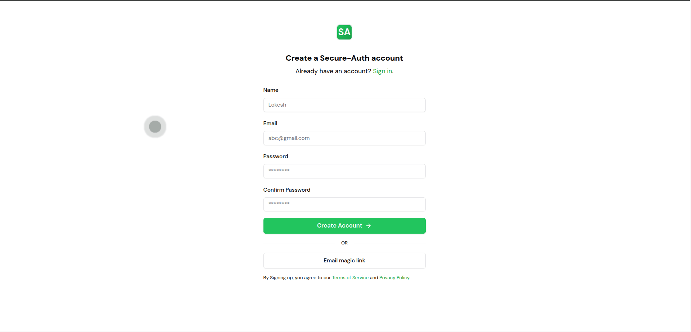
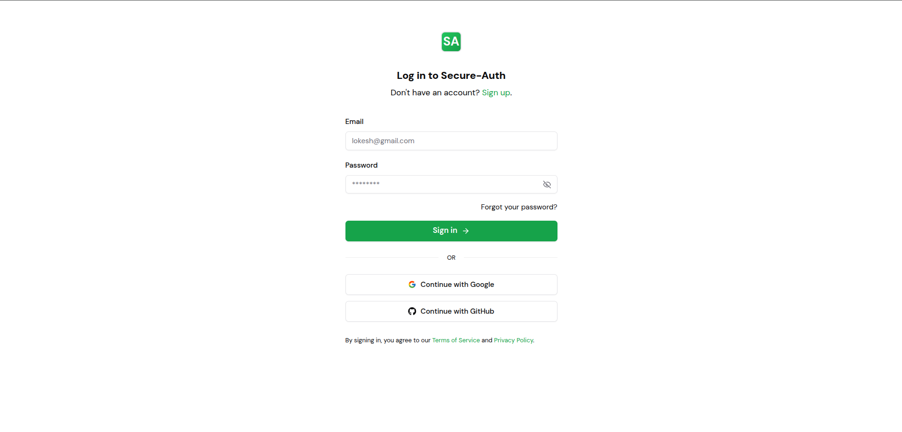
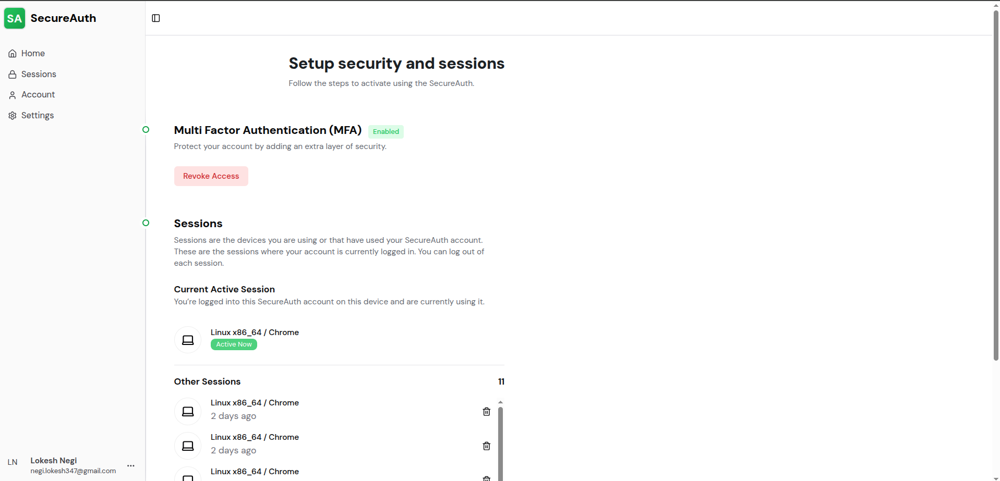
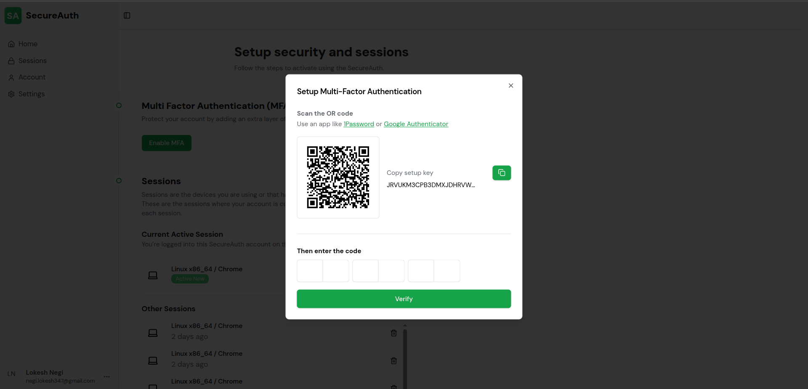
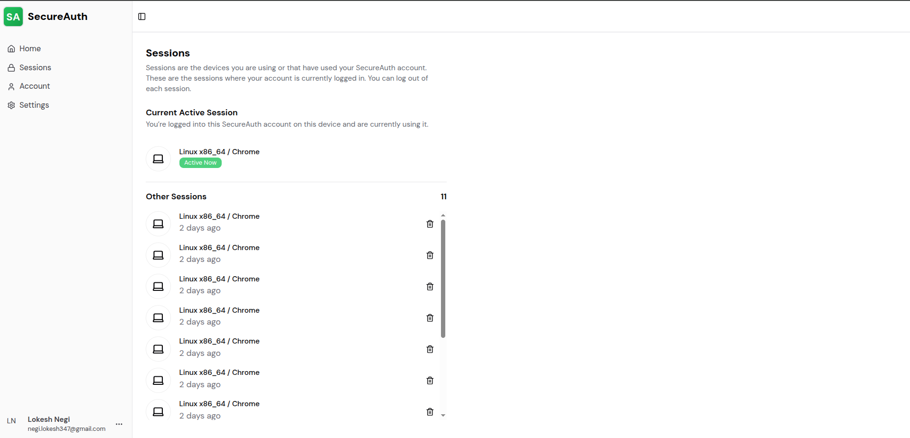

# 🔐 Secure Auth

An advanced authentication system built from scratch using modern technologies with a focus on security best practices.


<!-- Replace with your actual demo GIF/image -->

## ✨ Features

- **JWT Authentication** - Secure access & refresh token flow with HTTP-only cookies
- **Email Verification** - Account verification via email with verification codes
- **Two-Factor Authentication (2FA)** - TOTP-based MFA using authenticator apps
- **Password Recovery** - Secure forgot/reset password flow
- **Session Management** - View, manage, and revoke active sessions across devices
- **Modern UI** - Clean, responsive interface with dark mode support

## 🛠️ Tech Stack

| Frontend | Backend |
|----------|----------|
| Next.js 14 | Node.js |
| React 18 | Express.js |
| TypeScript | TypeScript |
| TailwindCSS | MongoDB |
| React Query | Mongoose |
| shadcn/ui | JWT (jsonwebtoken) |
| React Hook Form | Passport.js |
| Zod | Speakeasy (TOTP) |
| | Nodemailer (Email) |
| | Winston (Logging) |

## 📁 Project Structure

```
secure-auth/
├── client/          # Next.js frontend application
├── server/          # Express.js backend API
├── package.json     # Root workspace configuration
└── eslint.config.js # Shared ESLint configuration
```

## 🚀 Getting Started

### Prerequisites

- **Node.js 21.0.0** (required)
- MongoDB instance
- Gmail account with an App Password (for emails)

### Installation

1. **Clone the repository**

```bash
   git clone https://github.com/yourusername/secure-auth.git
   cd secure-auth
```

1. **Install dependencies**

```bash
   npm install
```

1. **Set up environment variables**

```bash
   # Server
   cp server/.env.example server/.env
   # Edit server/.env with your configuration
   
   # Client
   cp client/.env.example client/.env
   # Edit client/.env with your configuration
```

1. **Configure email (Gmail SMTP)**

   This project uses Nodemailer with Gmail SMTP. To set it up:
   - Enable **2-Step Verification** on your Google account
   - Generate an **App Password** under Google Account → Security → App Passwords
   - Add the following to your `server/.env`:

```env
   SMTP_HOST=smtp.gmail.com
   SMTP_PORT=587
   SMTP_USER=your@gmail.com
   SMTP_PASS=your_16_char_app_password
```

   > In development, emails are intercepted by **Ethereal** (a fake SMTP service). Check your terminal for a preview URL after triggering any email flow.

1. **Start development servers**

```bash
   # Terminal 1 - Start backend
   cd server && npm run dev
   
   # Terminal 2 - Start frontend
   cd client && npm run dev
```

1. **Open the application**
   - Frontend: <http://localhost:3000>
   - Backend: <http://localhost:8000>

## 📸 Screenshots

### Login Page



### Dashboard



### MFA Setup



### Session Management



## 🌐 Live Demo

- **Frontend**: [https://secure-auth-frontend-06jf.onrender.com](https://secure-auth-frontend-06jf.onrender.com)
- **Backend API**: [https://secure-auth-9chv.onrender.com](https://secure-auth-9chv.onrender.com)

## 📚 Documentation

- [Client Documentation](./client/README.md)
- [Server Documentation](./server/README.md) - Includes API documentation

## 🧑‍💻 Development

### Available Scripts

```bash
# Linting
npm run lint              # Lint all workspaces
npm run lint:fix          # Auto-fix linting issues

# Formatting
npm run format            # Format all files
npm run format:check      # Check formatting
```

Made with ❤️ by [Lokesh Negi](https://github.com/Lokesh01)
