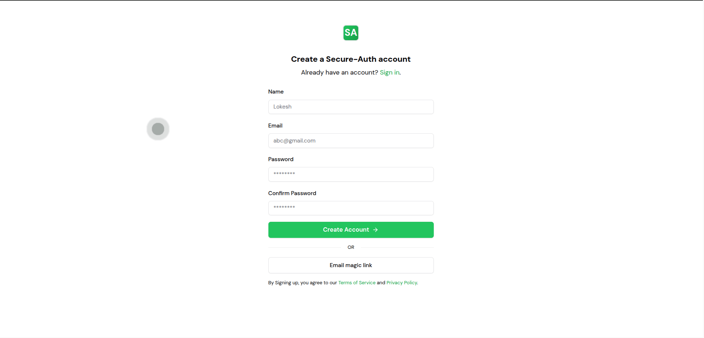
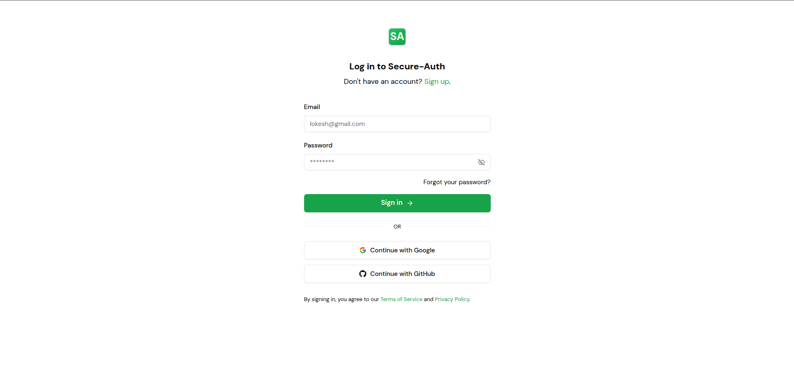
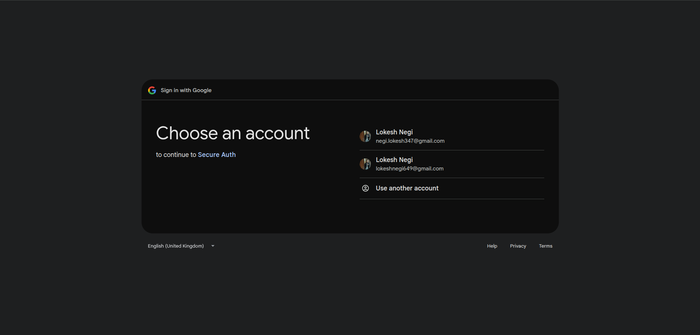
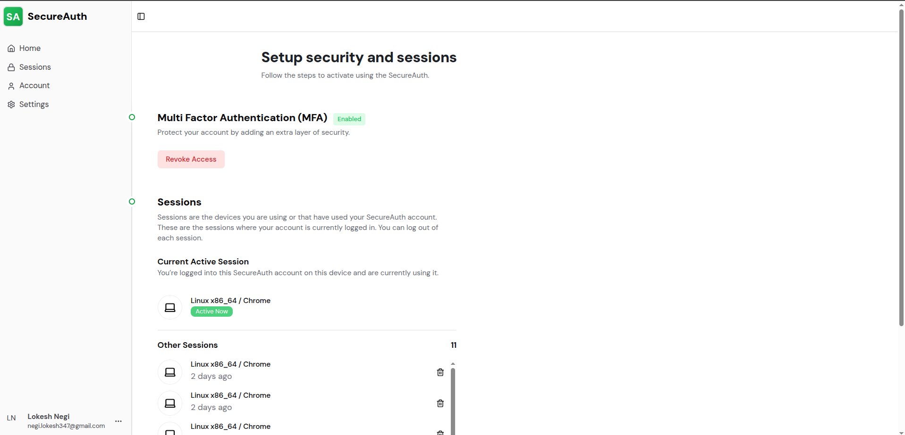
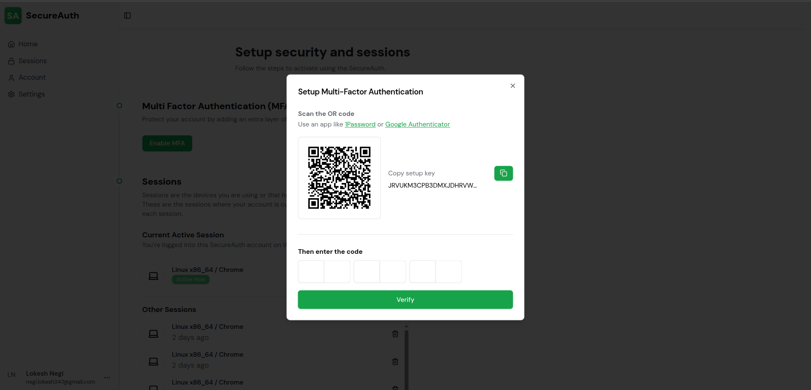
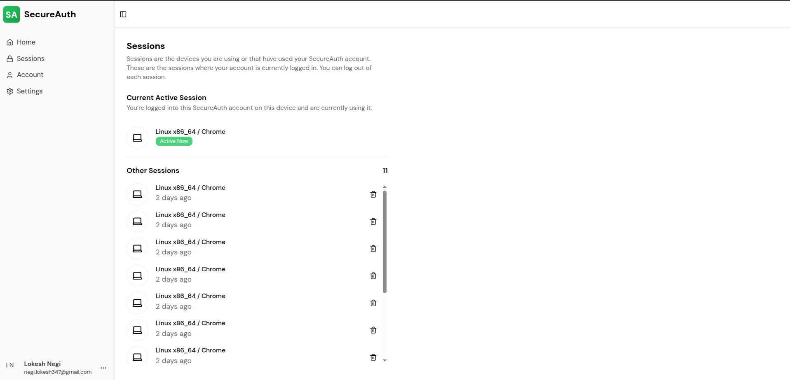

# 🔐 Secure Auth

An advanced authentication system built from scratch using modern technologies with a focus on security best practices.


<!-- Replace with your actual demo GIF/image -->

## ✨ Features

- **JWT Authentication** - Secure access & refresh token flow with HTTP-only cookies
- **OAuth 2.0** - Google and GitHub login with account auto-linking
- **Email Verification** - Account verification via email with verification codes
- **Two-Factor Authentication (2FA)** - TOTP-based MFA using authenticator apps
- **Password Recovery** - Secure forgot/reset password flow
- **Session Management** - View, manage, and revoke active sessions across devices
- **Modern UI** - Clean, responsive interface with dark mode support

## 🛠️ Tech Stack

| Frontend | Backend |
|----------|---------|
| Next.js 14 | Node.js |
| React 18 | Express.js |
| TypeScript | TypeScript |
| TailwindCSS | MongoDB |
| React Query | Mongoose |
| shadcn/ui | JWT (jsonwebtoken) |
| React Hook Form | Passport.js (JWT + OAuth 2.0) |
| Zod | Speakeasy (TOTP) |
| | Nodemailer + Brevo (Email) |
| | Winston (Logging) |

## 📁 Project Structure

```
secure-auth/
├── client/          # Next.js frontend application
├── server/          # Express.js backend API
├── package.json     # Root workspace configuration
└── eslint.config.js # Shared ESLint configuration
```

## 🚀 Getting Started

### Prerequisites

- **Node.js 21.0.0** (required)
- MongoDB instance
- Brevo account (for production emails)
- Google OAuth credentials (for Google login)
- GitHub OAuth credentials (for GitHub login)

### Installation

**1. Clone the repository**

```bash
git clone https://github.com/Lokesh01/secure-auth.git
cd secure-auth
```

**2. Install dependencies**

```bash
npm install
```

**3. Set up environment variables**

```bash
# Server
cp server/.env.example server/.env
# Edit server/.env with your configuration

# Client
cp client/.env.example client/.env
# Edit client/.env with your configuration
```

**4. Configure email**

This project uses Nodemailer with Brevo in production and Ethereal in development.

- Sign up at [brevo.com](https://brevo.com)
- Go to **Settings** → **SMTP & API** → **API Keys** and generate an API key
- Go to **Settings** → **Senders & IP** → **Senders** and verify your email address
- Add the following to your `server/.env`:

```env
BREVO_API_KEY=your_brevo_api_key
BREVO_SENDER_EMAIL=your@gmail.com
```

> In development, emails are intercepted by **Ethereal** automatically — no setup needed. Check your terminal for a preview URL after triggering any email flow.

**5. Configure OAuth**

**Google:**

- Go to [console.cloud.google.com](https://console.cloud.google.com)
- Create a project → Enable Google OAuth API
- Go to **APIs & Services** → **Credentials** → **Create OAuth Client ID**
- Add authorized redirect URI: `http://localhost:8000/api/v1/auth/google/callback`
- Add to your `server/.env`:

```env
GOOGLE_CLIENT_ID=your_google_client_id
GOOGLE_CLIENT_SECRET=your_google_client_secret
```

**GitHub:**

- Go to [github.com/settings/developers](https://github.com/settings/developers)
- Click **OAuth Apps** → **New OAuth App**
- Set callback URL: `http://localhost:8000/api/v1/auth/github/callback`
- Add to your `server/.env`:

```env
GITHUB_CLIENT_ID=your_github_client_id
GITHUB_CLIENT_SECRET=your_github_client_secret
```

**6. Start development servers**

```bash
# Terminal 1 - Start backend
cd server && npm run dev

# Terminal 2 - Start frontend
cd client && npm run dev
```

**7. Open the application**

- Frontend: <http://localhost:3000>
- Backend: <http://localhost:8000>

## 📸 Screenshots

### Login Page



### Outh Screen



### Dashboard



### MFA Setup



### Session Management



## 🌐 Live Demo

- **Frontend**: [https://secure-auth-client-beryl.vercel.app](https://secure-auth-client-beryl.vercel.app)
- **Backend API**: [https://secure-auth-9chv.onrender.com](https://secure-auth-9chv.onrender.com)

## 📚 Documentation

- [Client Documentation](./client/README.md)
- [Server Documentation](./server/README.md) - Includes API documentation

## 🧑‍💻 Development

### Available Scripts

```bash
# Linting
npm run lint              # Lint all workspaces
npm run lint:fix          # Auto-fix linting issues

# Formatting
npm run format            # Format all files
npm run format:check      # Check formatting
```

Made with ❤️ by [Lokesh Negi](https://github.com/Lokesh01)
